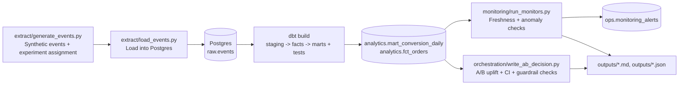

# Product Analytics - A/B Testing Pipeline (Postgres + dbt + Prefect)

   

End-to-end product analytics pipeline built on synthetic e-commerce event data. The project covers event tracking design, ingestion into Postgres, dbt transformations and tests, monitoring checks, and A/B test decision outputs.

## What it includes

- Event taxonomy and tracking spec
- ELT pipeline from raw events to analytics marts
- A/B test analysis with uplift, confidence intervals, and guardrails
- Monitoring checks for freshness and KPI anomalies
- Reproducible local setup with Docker Compose

## Run

Requirements: Docker Desktop

**Windows (PowerShell)**
```powershell
powershell -ExecutionPolicy Bypass -File .\scripts\demo.ps1
```

**macOS/Linux**
```bash
make demo
```

Without `make`:
```bash
docker compose down -v
docker compose up --build --abort-on-container-exit
```

Artifacts are written to `outputs/`:
- `ab_test_decision.md`
- `monitoring_report.md`
- `run_summary.json`

## Experiment setup

- Experiment: `new_checkout`
- Variants: `control` and `treatment`
- Assignment: user level
- Primary metric: purchase conversion
- Guardrail: average order value (AOV)

## Project structure

- `spec/event_tracking.md` - event taxonomy, required properties, and examples
- `extract/` - synthetic event generation and raw loading
- `warehouse/` - database initialization
- `dbt/` - staging, facts, marts, and tests
- `orchestration/` - Prefect flow and pipeline runner
- `monitoring/` - SQL and Python monitoring checks
- `airflow/` - optional Airflow DAG version of the pipeline
- `experiment/` - notebook-based analysis
- `docs/examples/` - committed sample outputs

## Architecture


