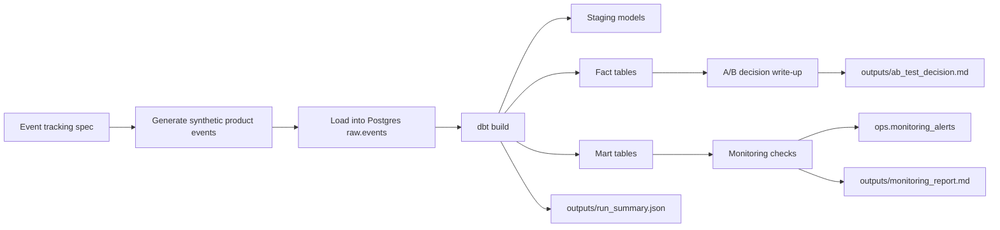

# Product Analytics A/B Testing Pipeline
**Postgres + dbt + Prefect + Monitoring + CI**


An end-to-end **product analytics pipeline** that starts with event tracking, builds analytics-ready models in dbt, runs monitoring checks, and finishes with a **decision-ready A/B test write-up**.

---

## Business question

**Should we ship a new checkout experience?**

The pipeline simulates a product experiment called `new_checkout`, transforms tracked events into analytics tables, evaluates the treatment against control, and writes a final recommendation based on:

- **Primary metric:** checkout → purchase conversion within 24 hours
- **Guardrail metric:** average order value (AOV)

The goal is not just to calculate uplift, but to show the full workflow behind a trustworthy experiment:
- tracking contract
- ingestion
- transformations
- tests
- monitoring
- decision artifact

---

## What this repo demonstrates

- **Event tracking standards** with a documented taxonomy and required properties
- **ELT pipeline** from raw events to analytics-ready marts
- **dbt modeling and tests** for quality and trust
- **A/B testing logic** with uplift, 95% confidence interval, and guardrail evaluation
- **Operational visibility** through pipeline run logs and monitoring alerts
- **Production-style orchestration** with Prefect, plus an Airflow version for portability
- **CI checks** covering formatting, linting, type checks, tests, and demo execution

---

## End-to-end flow



---

## Architecture

### 1) Tracking contract
The source of truth for instrumentation lives in:

- `spec/event_tracking.md`

It defines:
- naming rules
- required base properties
- event catalog
- examples of good vs bad tracking
- change control expectations

Tracked events include:

- `app_open`
- `signup_started`
- `signup_completed`
- `product_view`
- `add_to_cart`
- `checkout_started`
- `purchase_completed`

Experiment assignment is attached at the **user level** through:

- `experiment_key`
- `variant`

---

### 2) Extract + load
Synthetic product events are created in:

- `extract/generate_events.py`

They are then loaded into Postgres through:

- `extract/load_events.py`

By default, the demo is configured to generate:

- `6000` users
- `60` days of data
- deterministic output via `RANDOM_SEED=42`

The loader uses a temp table and inserts into `raw.events` with:

- `ON CONFLICT (event_id) DO NOTHING`

so reruns remain **idempotent for duplicate event IDs**.

---

### 3) Warehouse and schemas
Database initialization lives in:

- `warehouse/sql/init.sql`

The repo creates these schemas:

- `raw`
- `staging`
- `analytics`
- `ops`

Operational tables include:

- `ops.pipeline_runs` for run metadata
- `ops.monitoring_alerts` for freshness/anomaly alerts

Core raw table:

- `raw.events`

---

### 4) dbt models
The dbt project transforms raw events into typed and analysis-ready tables.

#### Staging
- `stg_events`
- `stg_users`

#### Facts
- `fct_orders`
- `fct_user_purchases`

#### Marts
- `mart_activation_daily`
- `mart_conversion_daily`
- `mart_retention_cohort`

Model tests in `dbt/models/schema.yml` cover things like:
- `not_null`
- `unique`
- accepted event names and variants
- revenue non-negativity
- relationship checks
- metric bounds
- timestamp sanity check (`event_ts <= now() + interval '5 minutes'`)

---

### 5) Orchestration
The main orchestration path is **Prefect**:

- `orchestration/flow.py`
- `orchestration/run_pipeline.py`

The flow runs:

1. generate events
2. load into Postgres
3. run `dbt build`
4. run monitoring
5. write A/B test decision artifact

The repo also includes an **Airflow version** of the same flow in:

- `airflow/dags/daily_product_analytics_pipeline.py`

That DAG is manual-triggered for demo purposes and mirrors the Prefect steps.

---

### 6) Monitoring
Monitoring lives in:

- `monitoring/run_monitors.py`
- `monitoring/monitors.sql`

It currently checks:

#### Freshness
- compares `now()` against `max(event_ts)` in `raw.events`
- default threshold: `24 hours`

#### Conversion anomaly
- calculates a z-score on the most recent day’s conversion rate
- compares against recent historical baseline
- only evaluates variants with enough daily checkout volume

Alerts are written to:

- `ops.monitoring_alerts`

Artifacts are written to:

- `outputs/monitoring_report.md`

---

### 7) Experiment decision artifact
The final recommendation is created by:

- `orchestration/write_ab_decision.py`

Logic:
- aggregates checkout starters and purchasers from `analytics.mart_conversion_daily`
- computes treatment vs control uplift
- calculates a **95% Wald confidence interval**
- checks AOV from `analytics.fct_orders`
- blocks shipment if:
  - the interval includes zero, or
  - AOV regresses by more than **2%**

Output:
- `outputs/ab_test_decision.md`

This makes the project feel more like an internal analytics deliverable than a pure SQL exercise.

---

## Example outputs

Committed sample artifacts for quick browsing:

- `docs/examples/ab_test_decision.md`
- `docs/examples/monitoring_report.md`
- `docs/examples/run_summary.json`

These help understand the project without running it.

---

## Repo structure

```text
.
├── airflow/                  # Airflow version of the pipeline
├── dbt/                      # dbt project: staging, facts, marts, tests
├── docs/
│   ├── examples/             # committed sample outputs
│   ├── ops/                  # incident example
│   └── support_playbook/     # analyst-facing response templates
├── experiment/               # notebook deep dive
├── extract/                  # synthetic event generation + loading
├── monitoring/               # freshness/anomaly checks
├── orchestration/            # Prefect flow + run entrypoint + decision writer
├── scripts/                  # demo helper
├── spec/                     # tracking contract
├── tests/                    # unit tests
└── warehouse/sql/            # schema/bootstrap SQL
```

---

## One-command demo

### Requirements
- Docker Desktop

### Windows (PowerShell)
```powershell
powershell -ExecutionPolicy Bypass -File .\scripts\demo.ps1
```

### macOS / Linux
```bash
make demo
```

### Without `make`
```bash
docker compose down -v
docker compose up --build --abort-on-container-exit
```

This will:

1. generate synthetic events
2. load them into `raw.events`
3. run `dbt build` (models + tests)
4. run monitoring checks
5. write final decision and run-summary artifacts

Artifacts will appear in:

- `outputs/ab_test_decision.md`
- `outputs/monitoring_report.md`
- `outputs/run_summary.json`

---

## Airflow alternative

To run the same project through Airflow instead of the default pipeline container:

```bash
docker compose -f docker-compose.yml -f airflow/docker-compose.airflow.yml up --build
```

Then open:

- `http://localhost:8080`

The Airflow setup is included to show orchestration portability, but the main demo path is still the standard project flow above.

---

## Local quality checks

The CI pipeline runs:

- formatting
- linting
- type checking
- unit tests
- demo execution

Useful local commands:

```bash
make quality
```

Or individually:

```bash
python -m black --check .
python -m ruff check .
python -m mypy .
python -m pytest
```

---

## How to review this repo quickly

If you only have a few minutes, use this order:

1. `docs/examples/ab_test_decision.md`
2. `docs/examples/monitoring_report.md`
3. `spec/event_tracking.md`
4. `dbt/models/schema.yml`
5. `orchestration/flow.py`
6. `monitoring/run_monitors.py`

That sequence shows:
- the business outcome
- the operational checks
- the tracking contract
- the warehouse quality layer
- the orchestration logic

---

## Limitations and next improvements

This repo is intentionally demo-friendly. In a production version, I might add:

- secret management instead of demo credentials
- incremental ingestion / replay strategy
- partitioning and retention policies
- alert routing to Slack/email
- experiment SRM checks and power analysis
- richer segmentation by device, country, and acquisition source
- BI layer on top of marts for stakeholder self-serve reporting

---

## Related docs

- `docs/ops/incident_example.md` — example incident workflow for broken dashboard numbers
- `docs/support_playbook/` — example analyst response templates
- `experiment/ab_test_analysis.ipynb` — deeper experiment analysis notebook

---

## Tech stack

- **Python 3.11**
- **Postgres 16**
- **dbt (Postgres)**
- **Prefect**
- **Airflow**
- **Docker Compose**
- **pytest / mypy / ruff / black**
- **GitHub Actions**

---

## Summary

This is a compact but production-shaped product analytics project that answers one practical question:

**Did the new checkout improve conversion enough to ship safely?**

It does that with a full workflow:
**tracking spec → raw events → dbt models → tests → monitoring → decision artifact**.
