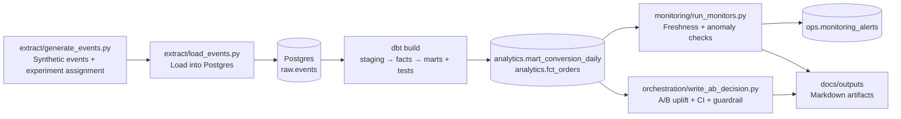

# Product Analytics - A/B Testing Pipeline (Postgres + dbt + Prefect)

   

A product analytics project that proves:
- **Tracking standards** (event taxonomy, properties, “bad vs good” patterns)
- **ELT pipeline** (raw → staging → marts)
- **A/B testing analysis** (uplift + 95% CI + guardrails + decision)
- **Orchestration + monitoring** (Prefect flow, run logs, freshness + anomaly checks)
- **Data quality** (dbt tests + business-rule validations)

## One-command demo
Requirements: Docker Desktop

**Windows (PowerShell):**
```powershell
powershell -ExecutionPolicy Bypass -File .\scripts\demo.ps1
```

**macOS/Linux:**
```bash
make demo
```

*No `make` installed?* You can also run:
```bash
docker compose down -v
docker compose up --build --abort-on-container-exit
```


This will:
1) Generate synthetic product events (with an A/B experiment)
2) Load them into Postgres (`raw.events`)
3) Run `dbt build` (models + tests)
4) Run monitoring checks (freshness + conversion anomaly)
5) Produce an **A/B test decision write-up** tied to tracked events

Outputs appear in `./outputs/`:
- `ab_test_decision.md`
- `monitoring_report.md`
- `run_summary.json`

## Repo structure
- `spec/event_tracking.md` - tracking taxonomy + properties + examples
- `extract/` - generate + load events into Postgres
- `warehouse/` - DB init (schemas/tables)
- `dbt/` - staging → facts → marts + tests
- `experiment/` - optional notebook-style analysis template
- `orchestration/` - Prefect flow + pipeline entrypoint
- `monitoring/` - monitors (freshness + anomaly) + runner
- `outputs/` - pipeline artifacts (written on every run)

## Architecture



**Committed examples (for quick browsing):**
- `docs/examples/ab_test_decision.md`
- `docs/examples/monitoring_report.md`
- `docs/examples/run_summary.json`

## What’s in the data
Synthetic events for an e-commerce style product:
- `app_open`, `signup_started`, `signup_completed`
- `product_view`, `add_to_cart`, `checkout_started`, `purchase_completed`

**Experiment:** `new_checkout` with variants `control` vs `treatment` assigned at the **user** level.
- Primary metric: **user conversion to purchase** within the window
- Guardrail: **average order value** (AOV)

## How to browse quickly
- Start with `docs/examples/ab_test_decision.md` (committed sample)
- Then check `docs/examples/monitoring_report.md`
- Then open `spec/event_tracking.md`
- Then look at `dbt/models/` and `dbt/models/schema.yml` for tests

## Production considerations (what I’d do next)
This repo is intentionally **demo-friendly**, but the design mirrors production patterns. To harden this for a real deployment I’d consider adding:
- Secret management (no hardcoded passwords), environment-based configs
- Incremental loading / dedup (idempotent runs)
- Real alert routing (Slack/email) and dashboards (Metabase/Grafana)
- Stronger stats methods + power sizing + experiment SRM checks
- Partitioning + retention policies for event tables

